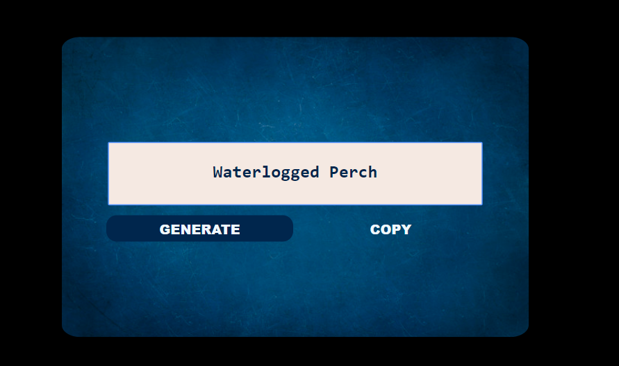

# About

Release Candidate Name Generator is a very simple javascript generator or could be called also assembler,
which takes one item from two separate arrays and assebles them together.

# Motivation

As a Front-End development student, it was a perfect exercise to pratice what I have learnt so far.

# Installation

* Download or clone the project
* Unzip/Install it

# How to use it?

* Open the index.html file in any browser
* To generate name - click on the "GENERATE" button
* To copy the name - click on the "COPY" button

# Visual

